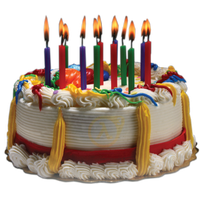

# Probability two people in a group share the same birthday

<a target="_blank" href="https://cran.r-project.org">R</a> function to calculate the probability that two people within a group of a specified size share the same birthday

Prof Corey J. A. Bradshaw  
<a href="http://globalecologyflinders.com" target="_blank">Global Ecology</a>, <a href="http://flinders.edu.au" target="_blank">Flinders University</a>, Adelaide, Australia  
October 2020  
<a href=mailto:corey.bradshaw@flinders.edu.au>e-mail</a>  

What's the probability that two people in a group share the same birthday? It will likely surprise you that the size of the group required for this probability to be high is much smaller than you think.

This Github repository provides all the 'under-the-bonnet' code for the Shiny App.
